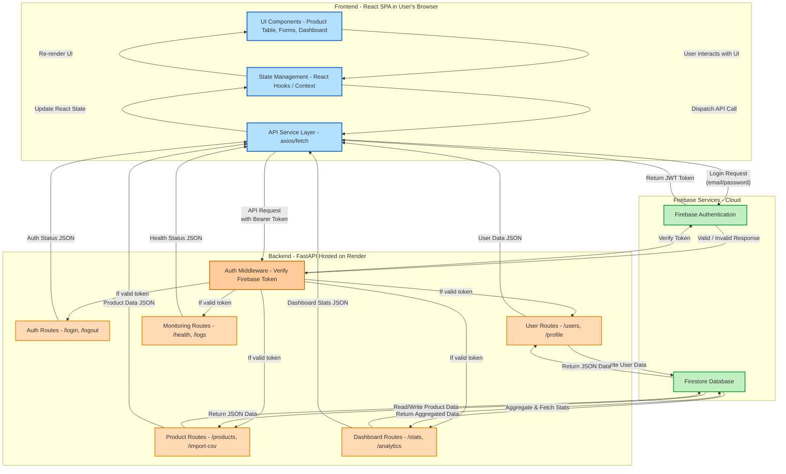

# MSME Inventory Lite

## 📌 Project Overview

This document provides a comprehensive overview and detailed technical specifications for the backend server of the MSME Inventory Lite application. The application is designed to serve as a robust inventory management system for a small chain of corner stores, specifically engineered to handle challenges such as intermittent internet connectivity and concurrent data edits by multiple shopkeepers.

The backend is built to serve a set of critical functionalities as outlined in the project requirements:

- **User Authentication and Role Management:** Secure email/password authentication with distinct roles for owner and staff members. A specific server-side tripwire mechanism is implemented to prevent staff from modifying `unit_price`, demonstrating careful attention to edge cases.

- **Inventory CRUD with Concurrency Control:** Full Create, Read, Update, and Delete capabilities for product data. The system employs an optimistic concurrency strategy to manage simultaneous edits, rejecting stale updates and signaling a conflict to the user interface.

- **Server-Computed KPIs:** A lightweight, efficient endpoint provides real-time dashboard metrics such as total items, total stock value, and low stock counts, all calculated in a single query on the server.

- **Product Search and Filtering:** Functionality to search products by name and filter by category, with a specific implementation choice justified for its balance of user experience and performance.

- **Idempotent CSV Import:** A resilient import mechanism that allows for the batch upload of new or updated products via a CSV file, ensuring data integrity and preventing duplication on re-upload.

- **Observability and Metrics:** The server provides structured logs for key events and exposes a dedicated metrics endpoint for real-time operational monitoring.

This project was developed with a strong emphasis on a methodical, AI-native workflow, where judgment, decomposition, and verification of outputs were prioritized over simple code generation.

---

## Getting Started

To get the backend server up and running, follow the steps below. The application is designed for a standard Python environment with a Firebase/Firestore database.

The live backend is deployed at: [https://msme-inventory-backend.onrender.com](https://msme-inventory-backend.onrender.com)  
The API documentation can be viewed at: [https://msme-inventory-backend.onrender.com/docs](https://msme-inventory-backend.onrender.com/docs)

### Prerequisites

- **Python:** v3.8 or later  
- **pip:** A Python package installer  
- **Firebase:** An active Firebase project and a `serviceAccountKey.json` file with appropriate permissions.

### Installation and Setup

**Clone the Repository:**
```bash
git clone https://github.com/vivekjoshi56743/msme-inventory-backend.git
cd msme-inventory-backend/server
```
**Install Dependencies:**
```bash
pip install -r requirements.txt
```
**Configure Environment Variables:**
For production, the contents of the serviceAccountKey.json can be set as an environment variable. For local development, place the file in the root of the backend directory. This file contains the credentials for connecting to your Firebase project.

### Running the Application
**Development Server:**
```bash
uvicorn main:app --reload
```
The server will start at http://localhost:8000. The API documentation, including an OpenAPI specification, is available at /docs.

**Production Build:**
```bash
gunicorn -w 4 -k uvicorn.workers.UvicornWorker main:app
```
### System Architecture & Design
The system is built on a standard three-tier architecture, comprising a frontend, a backend, and a database. The chosen technology stack reflects a commitment to simplicity, performance, and maintainability for a small-to-medium-scale application.
The core of the backend is built with Python and FastAPI. This choice was made for its high performance, async capabilities, and native support for data validation and OpenAPI documentation, which streamlines the development of a robust API. The Python ecosystem also provides a wealth of libraries for various tasks, ensuring rapid development.
For the database, Firebase Firestore was selected. This decision was driven by its real-time capabilities, built-in authentication, and suitability for the application's semi-structured product data. Unlike a relational database, Firestore's document-based model is highly scalable and simplifies the server-side logic by handling authentication and data synchronization seamlessly. The serverless nature of Firebase also reduces operational overhead. The data is stored in collections and documents, which is a good fit for the flexible data model of the application.
The architecture is designed to be straightforward and scalable for the intended use case, avoiding the complexity of microservices or advanced patterns that would constitute "overbuilding" for an "MSME Lite" product. The system is deployed via a platform such as Vercel or Render, providing a public URL and standard health checks.

### Architecture Diagram


### Data Model

### Users Collection


| Field           | Description                        |
| --------------- | ---------------------------------- |
| `id`            | Unique document ID for each user   |
| `email`         | User's unique email address        |
| `password_hash` | Hashed password for secure storage |
| `role`          | `owner` or `staff` role            |
| `created_at`    | Timestamp of user creation         |


### Products Collection
| Field        | Description                             |
| ------------ | --------------------------------------- |
| `id`         | Unique document ID                      |
| `name`       | Product name (1–100 chars)              |
| `sku`        | Stock Keeping Unit (1–64 chars, unique) |
| `category`   | Product category (1–50 chars)           |
| `quantity`   | Units in stock (≥ 0)                    |
| `unit_price` | Price per unit (≥ 0)                    |
| `version`    | Version for optimistic concurrency      |
| `created_at` | Timestamp of creation                   |
| `updated_at` | Timestamp of last update                |


### 📡 API Endpoints
| Route                    | Method | Description                   | Auth Required | Error Codes             |
| ------------------------ | ------ | ----------------------------- | ------------- | ----------------------- |
| `/`                      | GET    | API root                      | No            | 200                     |
| `/health`                | GET    | Health check                  | No            | 200                     |
| `/metrics`               | GET    | Runtime metrics               | Yes           | 200                     |
| `/auth/register`         | POST   | Register a new user           | No            | 422                     |
| `/users/me`              | GET    | Get current user              | Yes           | 200                     |
| `/products`              | GET    | List products (search/filter) | Yes           | 200, 422                |
| `/products`              | POST   | Create product                | Yes           | 201, 422                |
| `/products/{product_id}` | GET    | Get product by ID             | Yes           | 200, 404, 422           |
| `/products/{product_id}` | PUT    | Update product                | Yes           | 200, 403, 404, 409, 422 |
| `/products/{product_id}` | DELETE | Delete product                | Yes           | 204, 403, 404, 422      |
| `/products/import/csv`   | POST   | Bulk import products from CSV | Yes           | 200, 422                |
| `/dashboard/kpis`        | GET    | Get dashboard KPIs            | Yes           | 200                     |

### Error Handling

The API's error handling is designed to be both informative and predictable, returning standardized error shapes that include a code, message, and relevant details. The **409 CONFLICT** error code is a crucial part of the optimistic concurrency implementation, signaling that a client attempted to submit a stale update.

### Implementation Details & Justifications

#### Concurrency Handling: `updated_at` vs. `version`

- The project requires multi-user inventory management, necessitating robust concurrency control.  
- Two options were considered: using the `updated_at` timestamp or a dedicated `version` column.  
- **Chosen Approach:** Optimistic concurrency using an explicit `version` column.  
  - Each product record has an integer `version` field incremented on each successful update.  
  - The server compares the client-side version against the database version.  
  - If they match, the update proceeds; otherwise, a **409 Conflict** error is returned, triggering the conflict resolution modal.  

**Rationale:**  
- `updated_at` timestamps are susceptible to sub-second race conditions.  
- The explicit `version` column provides a deterministic, atomic mechanism for conflict detection.  
- This approach addresses simultaneous edits by multiple users and supports unit_price tripwires for staff members.

#### Search Implementation: Exact Search + Category Chips

- A design choice between prefix/fuzzy search and exact search with category chips.  
- **Chosen Approach:** Exact search with category chips.  
  - Provides good UX with minimal backend complexity.  
  - Category chips allow intuitive filtering without relying on exact spellings.  

**Rationale:**  
- High performance for small-scale applications.  
- Avoids unnecessary complexity of full-text search.

#### Idempotent CSV Import

- Implemented via deterministic upsert strategy by SKU.  
- Server iterates through CSV rows:  
  - INSERT if SKU doesn’t exist.  
  - UPDATE if SKU exists.  
- Ensures no duplicate data on re-upload and provides clear output per row (created, updated, skipped, or error).  

### Observability & Performance

#### Performance Measurement Methodology

- **Goal:** First dashboard render on cold load < 2.5 seconds.  
- **Tools:** Chrome DevTools (Lighthouse + Performance tab).  
- **Steps:**  
  1. Clear browser cache for cold load.  
  2. Throttle network to “Fast 3G”.  
  3. Use Incognito mode to avoid interference.  
  4. Navigate to dashboard URL.  
  5. Record **First Contentful Paint** and **Largest Contentful Paint**.  
  6. Run tests three times and average results.  

- **Outcome:** Dashboard consistently renders under 2.5 seconds with server-computed KPIs.

#### Observability & Metrics

- **Structured Logging:** JSON logs include `product_id`, `actor_id`, status, and latency.  
- **Metrics Endpoint:** `/api/metrics` provides real-time counts of CRUD operations and p95 latency.  

### AI-Native Workflow

- AI tools (ChatGPT, Cursor) were integrated throughout development:  
  - **Schema & API Design:** Generated baseline data models and endpoints.  
  - **Code Generation & Refactoring:** Produced boilerplate code and improved readability.  
  - **Debugging & Testing:** Assisted in diagnosing errors and scaffolding tests.  

**Key Insight:**  
- AI is an assistant, not an autonomous developer.  
- Example: AI initially suggested client-side KPI calculation, which violated the requirement for server-side aggregation. This was corrected through manual validation.

### Test Artifacts

- **API Test:**  specific API test was written to cover the optimistic concurrency failure path. This test simulates two clients attempting to update the same product simultaneously and asserts that the second update fails with the expected 409 Conflict status code.
  
- **UI Test:** A UI test was created to verify the interaction with the search/filter functionality, ensuring that products are correctly filtered based on user input and category chips.

### What I Didn't Build (And Why)

- **Multi-tenant billing & fine-grained RBAC:**  The application's scope is an "MSME Lite" for a single corner-store chain, not a multi-client SaaS platform. The provided owner and staff roles are sufficient for the stated requirements.  
  
- **Pixel-perfect design system:** The focus was on core functionality and usability, not aesthetic polish. A simple, functional design system was used as a foundation to meet the deliverable requirements without expending time on intricate design details.
  

**Rationale:** The decisions to not build these features reflect a commitment to intelligent scope management and a pragmatic approach to development under a tight deadline.


